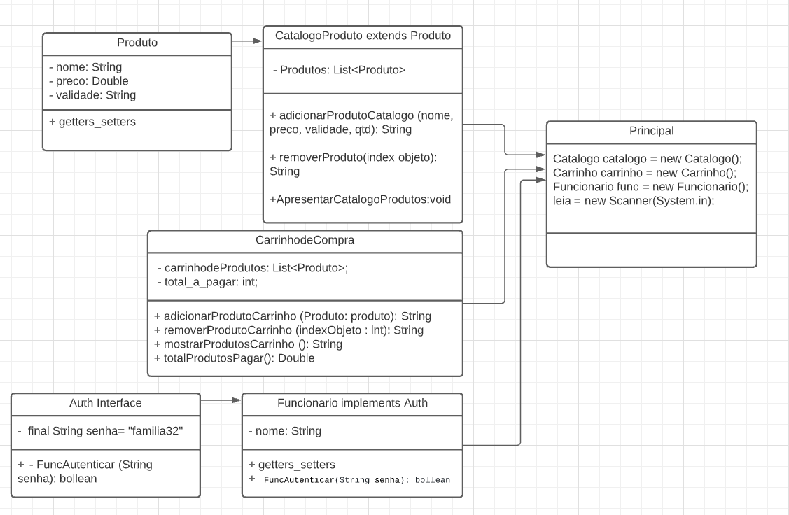

#Documentação UML de Classes



LINK LUCID: https://lucid.app/lucidchart/548e6f9d-b961-4c57-a9b8-b6e60b09beee/view?page=0_0#


## Classe CatalogodeProdutos
esta classe é responsável por manipular os produtos disponíveis 
para compra;

### MÉTODO: getProdutodoCatalogo (int id_produto)  <br>
Este metodo retorna um objeto da colletion com base no parametro id_produto
````
CatalogodeProdutos catalogo = new CatalogodeProdutos();
catalogo.getProdutodoCatalogo(2)  
````

### MÉTODO: AdicionarProduto (string nome, double preco, string validade, inteiro quantidade) <br>

Este método recebe parametros(nome,preco,validade,qtd) e constrói um objeto do tipo Produto
e adiciona dentro do catalogo de produtos disponíveis na loja para comprar;

exemplo de código:<br> 

````
CatalogodeProdutos catalogo = new CatalogodeProdutos();
catalogo.AdicionarProduto("Refrigerante",5.0,"25/05/2022",25);  //PRODUTO ADICIONADO AO CATALOGO :D
````


### MÉTODO: apresentarCatalogoProdutos <br>

Este metodo é responsável de apresentar todos os items cadastrados no catálogo (collection)
````
CatalogodeProdutos catalogo = new CatalogodeProdutos();
catalogo.apresentarCatalogoProdutos  
````

### Classe CarrinhodeCompras

### MÉTODO AdicionarProdutoCarrinho(Produto produto) 

Este método adiciona um produto ao carrinho do cliente e recebe como parametro
um objeto do tipo PRODUTO ou seja um objeto de um produto.
<br>

este metodo precisa do auxilio de outro metodo getProdutoCatalogo, pois 
ele precisa um objeto (produto) do catalogo exemplo de codigo;


````
produtoID = leia.nextInt();
carrinho.AdicionarProdutoCarrinho(catalogo.getProdutodoCatalogo(produtoID));


````

### removerProdutoCarrinho (int indexObjeto)

este método remove um produto do carrinho, único paramêtro que precisa
é o index de um produto cadastrado dentro da colletion do carrinho


### mostrarProdutosCarrinho() 

este método apresenta todos os items do carrinho como:

ID_PRODUTO: PRODUTO: PRECO: VALIDADE: